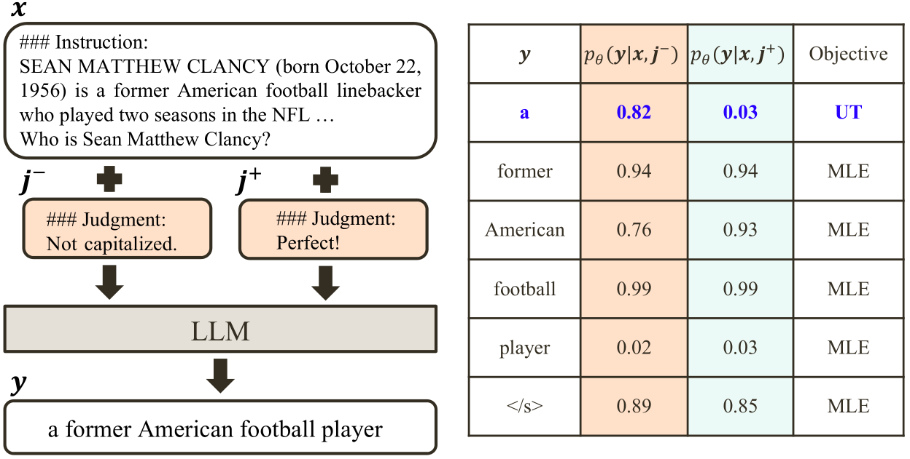

# Reasons to Reject? Aligning Language Models with Judgments

This repository contains code and resources of our paper,

[Reasons to Reject? Aligning Language Models with Judgments](https://arxiv.org/abs/2312.14591).

Weiwen Xu, Deng Cai, Zhisong Zhang, Wai Lam, Shuming Shi

<span id='all_catelogue'/>

### Catalogue:
* <a href='#introduction'>1. Introduction</a>
* <a href='#dataset'>2. Dataset</a>
* <a href='#train'>3. Fine-tuning</a>
* <a href='#inference'>4. Inference</a>
* <a href='#test'>5. Testing</a>
****

<span id='introduction'/>

#### 1. Introduction

As humans, we consistently engage in interactions with our peers and receive feedback in the form of natural language. This language feedback allows us to reflect on our actions, maintain appropriate behavior, and rectify our errors. The question arises naturally: can we use language feedback to align large language models (LLMs)? 


In contrast to previous research that aligns LLMs with reward or preference data, we present the first systematic exploration of alignment through the lens of language feedback (i.e., judgment). We commence with an in-depth investigation of potential methods that can be adapted for aligning LLMs with judgments, revealing that these methods are unable to fully capitalize on the judgments. To facilitate more effective utilization of judgments, we propose a novel framework, Contrastive Unlikelihood Training (CUT), that allows for fine-grained inappropriate content detection and correction based on judgments. 


<p align="center">

</p>


Our offline alignment results show that, with merely 1317 off-the-shelf judgment data, CUT (LLaMA2-13b) can beat the 175B DaVinci003 and surpass the best baseline by 52.34 points on AlpacaEval. The online alignment results demonstrate that CUT can align LLMs (LLaMA2-chat-13b) in an iterative fashion using model-specific judgment data, with a steady performance improvement from 81.09 to 91.36 points on AlpacaEval. Our analysis further suggests that judgments exhibit greater potential than rewards for LLM alignment and warrant future research.

<span id='dataset'/>

#### 2. Dataset

##### 2.1. Offline Alignment

To reproduce the offline experiments, please use the datasets from [Summarization Train](https://openaipublic.blob.core.windows.net/critiques/dataset/critiques/train.jsonl.gz), [Summarization Test](https://openaipublic.blob.core.windows.net/critiques/dataset/critiques/test.jsonl.gz), and [Shepherd](https://github.com/facebookresearch/Shepherd).
Please use the script `scripts/convert2alpaca.py` to convert the data into the Alpaca Format.


##### 2.2. Online Alignment

To reproduce the online experiments, we provide the training instances for 5 online interations in `data/iter`. 

##### 2.3. Judgment v.s. Rewards

We sample 1000 * 4 instruction-response-judgment triplets from [UltraFeedback](https://github.com/OpenBMB/UltraFeedback) and re-annotate them with only negative judgments. The new judgment data can be found in `data/UltraFeedback`.

<span id='train'/>

#### 3. Fine-tuning

##### 3.1. Prepare the environment

```bash
pip install -r requirments.txt
```

##### 3.2. Train LLMs with CUT 

###### 3.2.1. Online Alignment (the first online iteration as an example)

```bash
threshold=1.1
weight_unlike=1
name=cut-1plus-13b
CUDA_VISIBLE_DEVICES=0,1,2,3,4,5,6,7 torchrun --nproc_per_node=8 --master_port=1233 finetune_unlikelihood.py \
    --base_model saved_models/llama2-13b-chat-hf \
    --data-path data/iter/train-alpaca-sample-iter1.json \
    --output_dir ./saved_models/lora/${name} \
    --batch_size 8 \
    --micro_batch_size 1 \ 
    --num_epochs 1 \
    --learning_rate 0.0004 \
    --cutoff_len 2048 \
    --val_set_size 0 \
    --lora_r 16 \
    --lora_alpha 16 \
    --lora_dropout 0.05 \
    --lora_target_modules '[gate_proj, down_proj, up_proj]' \
    --train_on_inputs False \
    --add_eos_token False \
    --group_by_length False \
    --prompt_template_name alpaca \
    --lr_scheduler 'cosine' \
    --warmup_steps 100\
    --weight_unlike ${weight_unlike}\
    --threshold ${threshold}\
    --downsample 0.25\

CUDA_VISIBLE_DEVICES=0 python merge.py \
    --base_model_name_or_path saved_models/llama2-13b-chat-hf \
    --peft_model_path ./saved_models/lora/${name} \
    --output_dir ./saved_models/${name}
```

###### 3.2.2. Offline alignment (Shepherd as an example)
First, get the Shepherd dataset according to Sec. 2.1. Then use the following script:
```bash
threshold=1.2
weight_unlike=0.5
name=cut-1plus-13b
CUDA_VISIBLE_DEVICES=0,1,2,3,4,5,6,7 torchrun --nproc_per_node=8 --master_port=1233 finetune_unlikelihood.py \
    --base_model saved_models/llama2-13b-chat-hf \
    --data-path data/Shepherd/train-alpaca.json \
    --output_dir ./saved_models/lora/${name} \
    --batch_size 8 \
    --micro_batch_size 1 \ 
    --num_epochs 1 \
    --learning_rate 0.0004 \
    --cutoff_len 2048 \
    --val_set_size 0 \
    --lora_r 16 \
    --lora_alpha 16 \
    --lora_dropout 0.05 \
    --lora_target_modules '[gate_proj, down_proj, up_proj]' \
    --train_on_inputs False \
    --add_eos_token False \
    --group_by_length False \
    --prompt_template_name alpaca \
    --lr_scheduler 'cosine' \
    --warmup_steps 100\
    --weight_unlike ${weight_unlike}\
    --threshold ${threshold}\
    --downsample 0.25\

CUDA_VISIBLE_DEVICES=0 python merge.py \
    --base_model_name_or_path saved_models/llama2-13b-chat-hf \
    --peft_model_path ./saved_models/lora/${name} \
    --output_dir ./saved_models/${name}
```

<span id='inference'/>

#### 4. Inference

##### 4.1. Checkpoint Release

We present our [CUT model](https://huggingface.co/xww033/cut-13b), which has undergone four online iterations and successfully achieved a score of 91.36 points on [AlpacaEval](https://tatsu-lab.github.io/alpaca_eval).

##### 4.2. Inference Template

We follow the inference template used from [Stanford Alpaca](https://github.com/tatsu-lab/stanford_alpaca):

```
Below is an instruction that describes a task. Write a response that appropriately completes the request.

### Instruction:
{instruction}

### Response:
```

##### 4.3. CLI

[Fastchat](https://github.com/lm-sys/FastChat) provides a simple setup for those interested in trying our aligned model. After downloading the [CUT model](https://huggingface.co/xww033/cut-13b) through HuggingFace, clone the Fastchat repository:

```bash
git clone https://github.com/lm-sys/FastChat.git
cd FastChat
```

Download the required packages:

```bash
pip install --upgrade pip  # enable PEP 660 support
pip install -e .
```

Finally, run the following:

```bash
python -m fastchat.serve.cli --model-path xww033/cut-13b --conv-template alpaca
```


<span id='test'/>

#### 5. Testing

##### 5.1. Generation-based Evaluation

We evaluate the model on [AlpacaEval](https://tatsu-lab.github.io/alpaca_eval). Please first install the evaluation tool:

```bash 
pip install alpaca-eval
```

The following script is employed to request the LLM to produce responses to the provided 805 instructions:

```bash
python scripts/generate.py --base_model_name_or_path <model checkpoint>
```

The generated responses would be saved in `<model checkpoint>/alpaca_eval.json`, which is subsequently submitted for GPT4 evaluation:

```
alpaca_eval --model_outputs <model checkpoint>/alpaca_eval.json
```

##### 5.2. Ranking-based Evaluation

We evaluate the model's performance on ARC, HellaSwag, MMLU and TruthfulQA, utilizing the [LLM Evaluation Harness](https://github.com/EleutherAI/lm-evaluation-harness).

## BibTeX

```
@article{xu2023reasons,
  title={Reasons to Reject? Aligning Language Models with Judgments},
  author={Xu, Weiwen and Cai, Deng and Zhang, Zhisong and Lam, Wai and Shi, Shuming},
  journal={arXiv preprint arXiv:2312.14591},
  year={2023}
}
```
